# AI MARKETING ANALYTICS - ENGINEERING ARTIFACTS
## Jira Tickets (JSON), ERD (Mermaid), OpenAPI 3.0, React Components
**Created:** December 31, 2025 | **Version:** 1.0

---

## PART A: JIRA TICKETS (30 TOTAL - JSON IMPORT FORMAT)

### How to Import into Jira
1. Navigate to **Jira Project → Tools → Import & Export → Import Issues**
2. Copy the JSON below into Jira Issue Importer
3. Map fields: Key → Summary, Type → Issue Type, Points → Story Points
4. Assign to team members; set sprint for MVP tickets

### JSON Data

```json
{
  "issues": [
    {
      "key": "MVP-001",
      "type": "Task",
      "summary": "Database Schema Setup (8 tables, 7 MVs, indexes)",
      "description": "Create all new tables (campaign_costs, campaign_attribution, marketing_job_runs, marketing_llm_log, recommendation_decisions, pii_access_log, api_request_log, marketing_scheduler_log) and materialized views. Set up pg_cron refresh schedules.",
      "storyPoints": 5,
      "priority": "P0",
      "component": "Database",
      "acceptanceCriteria": [
        "All 8 tables created with constraints, indexes",
        "7 MVs with hourly/daily refresh schedules",
        "7 data quality checks pass (null campaign_ids, conversion > clicks, etc.)",
        "Database backup strategy confirmed",
        "Schema documented in README"
      ],
      "estimatedDays": 3,
      "dependencies": []
    },
    {
      "key": "MVP-002",
      "type": "Story",
      "summary": "KPI Endpoint (GET /api/v1/kpi)",
      "description": "Implement GET /api/v1/kpi endpoint returning daily KPI metrics (sends, opens, clicks, conversions, spend, open_rate, click_rate, conversion_rate, cost_per_conversion, roi). Support optional campaign_id, start_date, end_date filters. Include Redis caching (30-min TTL), Prometheus metrics (request count, latency histogram, cache hits), and structured JSON logging.",
      "storyPoints": 3,
      "priority": "P0",
      "component": "Backend API",
      "acceptanceCriteria": [
        "GET /api/v1/kpi returns list of KPI metrics",
        "Latency <100ms (p95) via caching",
        "Filters work: campaign_id, start_date, end_date",
        "Prometheus metrics exposed at /metrics",
        "Request/response logged to stdout as JSON",
        "Error responses return 400/404/500 with request_id"
      ],
      "estimatedDays": 2,
      "dependencies": ["MVP-001"]
    },
    {
      "key": "MVP-003",
      "type": "Story",
      "summary": "KPI Dashboard Component (React)",
      "description": "Build AIMarketingPage component with 8-metric summary cards (total sends, opens, clicks, conversions, spend, avg open rate, avg conversion rate, avg ROI). Integrate useSWRKPI hook for data fetching with 30-second dedup window. Support date filter controls.",
      "storyPoints": 3,
      "priority": "P0",
      "component": "Frontend",
      "acceptanceCriteria": [
        "Dashboard displays 8 KPI metric cards",
        "Data updates every 30 seconds without duplicate requests",
        "Filter by start_date/end_date",
        "Loading and error states render correctly",
        "Mobile responsive (Tailwind breakpoints)"
      ],
      "estimatedDays": 2,
      "dependencies": ["MVP-002"]
    },
    {
      "key": "MVP-004",
      "type": "Story",
      "summary": "Campaign List Endpoint (GET /api/v1/campaigns)",
      "description": "Implement GET /api/v1/campaigns returning paginated list of campaigns with KPI summary. Support filtering by status, channel, date range. Include sorting (by ROI, send volume, conversion rate). Return 20 campaigns per page by default.",
      "storyPoints": 3,
      "priority": "P0",
      "component": "Backend API",
      "acceptanceCriteria": [
        "Returns paginated list (default 20/page)",
        "Filters: status, channel, date range",
        "Sort: roi, send_volume, conversion_rate",
        "Latency <200ms (p95)",
        "Includes metadata (total_count, page, has_next)"
      ],
      "estimatedDays": 2,
      "dependencies": ["MVP-001"]
    },
    {
      "key": "MVP-005",
      "type": "Story",
      "summary": "Campaign List UI (React)",
      "description": "Build CampaignList component displaying campaigns in sortable, paginated table. Columns: name, date, sends, opens, clicks, conversions, open_rate, click_rate, spend, ROI. Support inline sorting by clicking column headers. Include 'Drilldown' action button per row.",
      "storyPoints": 3,
      "priority": "P0",
      "component": "Frontend",
      "acceptanceCriteria": [
        "Table displays campaigns with 10 columns",
        "Sorting toggles asc/desc per column",
        "Pagination: 20/page, 'Next'/'Prev' buttons",
        "Drilldown button triggers modal (see MVP-007)",
        "Responsive table scrolls horizontally on mobile"
      ],
      "estimatedDays": 2,
      "dependencies": ["MVP-004", "MVP-005"]
    },
    {
      "key": "MVP-006",
      "type": "Story",
      "summary": "Drilldown Endpoint (GET /api/v1/campaigns/{id}/drilldown)",
      "description": "Implement GET /api/v1/campaigns/{id}/drilldown?date=YYYY-MM-DD returning day-level metrics (sends, opens, clicks, conversions, unsubscribes, spend, open_rate, click_rate). Include optional hourly sparkline data for charting.",
      "storyPoints": 3,
      "priority": "P0",
      "component": "Backend API",
      "acceptanceCriteria": [
        "Returns day-level drilldown metrics",
        "Latency <300ms (p95)",
        "Hourly sparkline data included (optional)",
        "Validates campaign_id exists before returning (404 if not)",
        "Logged as PII access in pii_access_log table"
      ],
      "estimatedDays": 2,
      "dependencies": ["MVP-001"]
    },
    {
      "key": "MVP-007",
      "type": "Story",
      "summary": "Drilldown UI + PII Consent Modal (React)",
      "description": "Build DrilldownPanel component showing day-level metrics with funnel chart (sends→opens→clicks→conversions). Include PII consent modal that must be accepted before drilldown data displays. Log consent acceptance with timestamp.",
      "storyPoints": 3,
      "priority": "P0",
      "component": "Frontend",
      "acceptanceCriteria": [
        "PII consent modal appears before drilldown renders",
        "Modal text explains data classification, GDPR/CCPA implications",
        "Accept button persists consent (localStorage); Decline closes modal",
        "Drilldown shows funnel chart with sparklines",
        "Metrics card displays: sends, opens, clicks, conversions, unsubscribes"
      ],
      "estimatedDays": 2,
      "dependencies": ["MVP-006"]
    },
    {
      "key": "MVP-008",
      "type": "Story",
      "summary": "Recommendations Engine (Rule-Based)",
      "description": "Implement recommendation generation logic: 7 types (test_creative, optimize_send_time, increase_budget, pause_low_roi, expand_segment, reduce_frequency, a_b_test_copy). Confidence scoring: base_score × sample_adequacy × trend_stability × recency_bonus. Store decisions in recommendation_decisions table.",
      "storyPoints": 4,
      "priority": "P1",
      "component": "Backend Services",
      "acceptanceCriteria": [
        "7 recommendation types implemented as rule engine",
        "Confidence scores 0-1 with clear formula documentation",
        "Recommendation stored in recommendation_decisions table",
        "GET /api/v1/recommendations returns pending + accepted recommendations",
        "Each recommendation includes: type, confidence, expected_impact, created_at"
      ],
      "estimatedDays": 3,
      "dependencies": ["MVP-001"]
    },
    {
      "key": "MVP-009",
      "type": "Task",
      "summary": "Background Job Scheduler (APScheduler)",
      "description": "Set up APScheduler with PostgreSQL job store. Implement recurring job: 'evaluate_recommendations' every 30 minutes. Log job execution to marketing_scheduler_log table (job_id, status, output, next_run_time). Set up health check endpoint.",
      "storyPoints": 4,
      "priority": "P1",
      "component": "Backend Services",
      "acceptanceCriteria": [
        "APScheduler configured with Postgres backend",
        "Job runs every 30 minutes reliably",
        "All executions logged to marketing_scheduler_log",
        "Health check: GET /health returns scheduler status",
        "Graceful shutdown: in-flight jobs complete before app exits"
      ],
      "estimatedDays": 2,
      "dependencies": ["MVP-008"]
    },
    {
      "key": "MVP-010",
      "type": "Story",
      "summary": "Accept Recommendation Endpoint (POST /api/v1/recommendations/{id}/accept)",
      "description": "Implement POST endpoint accepting/rejecting recommendations. Update recommendation_decisions table with decision, accepted_by (user_id), accepted_at (timestamp). Trigger follow-up actions (e.g., queue email, update campaign budget).",
      "storyPoints": 2,
      "priority": "P1",
      "component": "Backend API",
      "acceptanceCriteria": [
        "POST endpoint updates recommendation_decisions.decision",
        "Records user_id, timestamp, optional reason_declined",
        "Returns 200 with updated recommendation object",
        "404 if recommendation_id not found",
        "Follow-up action queued (email alert to campaign owner)"
      ],
      "estimatedDays": 1,
      "dependencies": ["MVP-008"]
    },
    {
      "key": "MVP-011",
      "type": "Task",
      "summary": "Observability Setup (Prometheus, Alerts, Grafana)",
      "description": "Configure structured JSON logging middleware. Export Prometheus metrics: request_count, latency_histogram, cache_hits, job_duration, error_rate. Set up 7 AlertManager alert rules (high error rate >0.1%, latency p95 >200ms, stale data >5min, job failure). Deploy Grafana dashboard (8 panels).",
      "storyPoints": 4,
      "priority": "P1",
      "component": "DevOps/Observability",
      "acceptanceCriteria": [
        "Structured JSON logs output to stdout (request_id, latency_ms, status_code, db_latency_ms)",
        "Prometheus /metrics endpoint returns 10+ metrics",
        "AlertManager rules fire correctly (tested with synthetic load)",
        "Grafana dashboard: request rate, error rate, latency heatmap, cache hit %, job success %",
        "On-call runbook for high error rate incident (how to investigate)"
      ],
      "estimatedDays": 3,
      "dependencies": ["MVP-002", "MVP-004", "MVP-006"]
    },
    {
      "key": "V1-001",
      "type": "Task",
      "summary": "Cost Data Integration (Fintech APIs)",
      "description": "Integrate with cost data source (Stripe, Shopify, Meta Ads API, Google Ads API). Normalize spend data into campaign_costs table (campaign_id, cost_date, channel, spend_amount, currency). Implement daily scheduled sync job.",
      "storyPoints": 4,
      "priority": "P0",
      "component": "Backend Services",
      "acceptanceCriteria": [
        "Cost data synced daily from ≥1 source",
        "All costs normalized to same currency (USD)",
        "Reconciliation report: total_spend matches source",
        "Sync job retries on API failure (exponential backoff)",
        "Audit log: which records synced, when, data_version"
      ],
      "estimatedDays": 3,
      "dependencies": ["MVP-001"]
    },
    {
      "key": "V1-002",
      "type": "Story",
      "summary": "ROI Dashboard (GET /api/v1/campaigns/{id}/roi)",
      "description": "Build API endpoint returning ROI metrics: total_spend, attributed_revenue, ROI ratio, ROAS. Visualize in React dashboard with cards + trend line chart (7/30/90-day periods). Support multi-period comparison.",
      "storyPoints": 3,
      "priority": "P0",
      "component": "Backend API + Frontend",
      "acceptanceCriteria": [
        "Endpoint returns roi, roas, total_spend, attributed_revenue",
        "Dashboard card shows current ROI with comparison to prior period",
        "Trend chart: ROI over last 30 days",
        "ROAS breakdown by channel (email vs. SMS vs. push)",
        "Negative ROI campaigns highlighted in red"
      ],
      "estimatedDays": 2,
      "dependencies": ["V1-001"]
    },
    {
      "key": "V1-003",
      "type": "Story",
      "summary": "Multi-Period Comparison (YoY, MoM)",
      "description": "Add comparison view: select two date ranges and compare KPIs side-by-side. Calculate delta (absolute + percentage). Highlight improvements/regressions. Support YoY (vs. 1 year ago), MoM (vs. previous month), WoW (vs. previous week).",
      "storyPoints": 2,
      "priority": "P1",
      "component": "Frontend",
      "acceptanceCriteria": [
        "Comparison modal: select two date ranges",
        "Side-by-side metric cards with delta % shown",
        "Green arrow up (improvement), red arrow down (regression)",
        "YoY/MoM/WoW presets for quick selection",
        "Comparison table: metric, period1, period2, delta, % change"
      ],
      "estimatedDays": 1,
      "dependencies": ["MVP-003"]
    },
    {
      "key": "V1-004",
      "type": "Story",
      "summary": "LLM Insight Generation (Together.AI Integration)",
      "description": "Integrate Llama-3.3-70B-Instruct-Turbo from Together.AI. For each campaign, generate 2-3 actionable insights using low-rank facts about KPIs, trends, and recommendations. API call with 5-second timeout; fallback to deterministic text if LLM fails. Cache insights for 1 hour.",
      "storyPoints": 4,
      "priority": "P1",
      "component": "Backend Services",
      "acceptanceCriteria": [
        "LLM call for each campaign drilldown (if cost_data available)",
        "Prompt: 'Given KPIs [X], recommend next action'",
        "Response: 2-3 sentences, max 200 tokens",
        "5-second timeout; fallback text if fails",
        "Cost tracked in marketing_llm_log table",
        "Insights cached (1-hour TTL) to avoid repeated calls"
      ],
      "estimatedDays": 2,
      "dependencies": ["V1-002", "MVP-001"]
    },
    {
      "key": "V1-005",
      "type": "Story",
      "summary": "Advanced Filtering (Channel, Status, Budget)",
      "description": "Extend FilterBar with multi-select dropdowns: channel (email, SMS, push, web), status (active, paused, draft, completed), budget range ($0-$10k). Filter campaigns table in real-time. Support filter presets (saved filters).",
      "storyPoints": 2,
      "priority": "P2",
      "component": "Frontend",
      "acceptanceCriteria": [
        "Multi-select dropdowns for channel, status",
        "Budget range slider (min/max inputs)",
        "Campaigns table filters in <100ms",
        "Save/load filter presets (localStorage)",
        "Clear all filters button"
      ],
      "estimatedDays": 1,
      "dependencies": ["MVP-005"]
    },
    {
      "key": "V1-006",
      "type": "Story",
      "summary": "CSV/PDF Export",
      "description": "Add export button to dashboard: generates CSV or PDF of campaigns table, KPI metrics, selected date range. Background job queues export; user downloads via email link (S3 pre-signed URL).",
      "storyPoints": 1,
      "priority": "P2",
      "component": "Backend + Frontend",
      "acceptanceCriteria": [
        "Export button: 'Download as CSV' / 'Download as PDF'",
        "CSV includes all visible columns (name, date, metrics)",
        "PDF: formatted report with charts",
        "Exports generated in background (SQS/Celery)",
        "Download link emailed to user with 24-hour expiration"
      ],
      "estimatedDays": 1,
      "dependencies": ["MVP-005"]
    },
    {
      "key": "V2-001",
      "type": "Story",
      "summary": "Multi-Touch Attribution (Linear, Time-Decay)",
      "description": "Implement attribution model options: first-touch, last-click, linear, time-decay. Store in campaign_attribution table. Allow users to toggle model in UI; recalculate metrics dynamically. Visualize attribution flow diagram.",
      "storyPoints": 4,
      "priority": "P0",
      "component": "Backend + Frontend",
      "acceptanceCriteria": [
        "4 attribution models implemented in backend",
        "campaign_attribution table stores per-model results",
        "API endpoint: GET /api/v1/campaigns/{id}/attribution?model=linear",
        "UI dropdown toggles between models",
        "Sankey diagram shows attribution flow (touches → conversions)"
      ],
      "estimatedDays": 3,
      "dependencies": ["V1-001"]
    },
    {
      "key": "V2-002",
      "type": "Story",
      "summary": "Cohort Segmentation (RFM + Custom)",
      "description": "Segment customers by RFM (Recency, Frequency, Monetary). Implement cohort analysis: compare metrics across segments (high-value, at-risk, new, dormant). Custom cohort builder: allow formula-based definitions (e.g., open_rate >20% AND spend <$1000).",
      "storyPoints": 3,
      "priority": "P1",
      "component": "Backend + Frontend",
      "acceptanceCriteria": [
        "RFM cohorts auto-calculated (daily refresh)",
        "Cohort table: cohort_name, count, avg_spend, avg_conversion_rate",
        "Custom cohort builder: drag-drop formula (AND/OR logic)",
        "Performance by cohort: compare KPIs across segments",
        "Save custom cohorts for reuse"
      ],
      "estimatedDays": 2,
      "dependencies": ["MVP-001"]
    },
    {
      "key": "V2-003",
      "type": "Story",
      "summary": "Incrementality Testing Framework",
      "description": "Design framework to measure true campaign lift vs. baseline. Implement matched control group selection (propensity score matching). API endpoint to analyze test results: estimated_lift, confidence_interval, statistical_significance (p-value).",
      "storyPoints": 4,
      "priority": "P1",
      "component": "Backend",
      "acceptanceCriteria": [
        "Test creation: select treatment group + control group",
        "Propensity matching: balance groups on observed covariates",
        "Analysis endpoint returns: estimated_lift %, CI, p-value",
        "Results table: campaigns, lift, CI, significance (p<0.05)",
        "Power calculator: how many samples needed for significance"
      ],
      "estimatedDays": 3,
      "dependencies": ["MVP-001"]
    },
    {
      "key": "V2-004",
      "type": "Story",
      "summary": "Fraud Detection & Anomaly Alerts",
      "description": "Implement statistical anomaly detection: flag campaigns with unusual open rates (>σ3), click fraud patterns (opens >> clicks), or rapid unsubscribe spikes. Real-time alerts via Slack/email. Blocklist suspicious publisher IPs.",
      "storyPoints": 2,
      "priority": "P2",
      "component": "Backend Services",
      "acceptanceCriteria": [
        "Anomaly detection: z-score >3 for open_rate",
        "Click fraud: flag if CTR >50% or clicks >opens",
        "Unsubscribe spike: alert if >10% daily increase",
        "Real-time alerts via Slack (webhook)",
        "Blocklist UI: add/remove suspect IPs"
      ],
      "estimatedDays": 2,
      "dependencies": ["MVP-001"]
    },
    {
      "key": "V2-005",
      "type": "Story",
      "summary": "Custom Metrics Builder",
      "description": "Allow users to define custom KPIs via formula editor (e.g., (clicks - unsubscribes) / sends * 100). Implement expression parser + DAG evaluation. Store custom metrics in user-defined metrics table. Make available in reports & dashboards.",
      "storyPoints": 2,
      "priority": "P3",
      "component": "Backend + Frontend",
      "acceptanceCriteria": [
        "Formula editor: input formula text (e.g., (A - B) / C * 100)",
        "Parse expressions into AST (abstract syntax tree)",
        "Validate: all variables exist, no circular refs",
        "Evaluate formula against campaign KPIs",
        "Custom metrics saved + reusable in dashboards"
      ],
      "estimatedDays": 2,
      "dependencies": ["MVP-001"]
    },
    {
      "key": "V2-006",
      "type": "Story",
      "summary": "Advanced LLM Optimization",
      "description": "Enhance LLM prompts with in-context learning: few-shot examples of successful campaigns. Implement prompt caching to reduce token costs. Add multi-turn conversation for drill-down questions (e.g., 'Why did open rate drop?').",
      "storyPoints": 1,
      "priority": "P3",
      "component": "Backend Services",
      "acceptanceCriteria": [
        "Few-shot prompting: include 3 high-ROI campaign examples",
        "Prompt caching: reuse cached contexts for similar campaigns",
        "Conversation history: maintain chat context across requests",
        "Cost reduction: measure token usage before/after optimization",
        "Quality: user feedback ratings on LLM insights"
      ],
      "estimatedDays": 1,
      "dependencies": ["V1-004"]
    }
  ]
}
```

---

## PART B: POSTGRESQL ERD (MERMAID DIAGRAM)

```mermaid
erDiagram
    
    %% Existing tables (SwipeSavvy base)
    ai_campaigns ||--o{ campaign_metrics : has
    ai_campaigns ||--o{ user_segments : has
    
    %% New tables (MVP)
    ai_campaigns ||--o{ campaign_costs : tracks
    ai_campaigns ||--o{ campaign_attribution : measures
    ai_campaigns ||--o{ recommendation_decisions : receives
    ai_campaigns ||--o{ marketing_job_runs : "data loaded by"
    ai_campaigns ||--o{ marketing_llm_log : "insights from"
    ai_campaigns ||--o{ marketing_scheduler_log : "scheduled for"
    
    %% PII Access (not campaign-specific)
    pii_access_log ||--o{ api_request_log : "correlates with"
    
    %% Relationships detail
    
    ai_campaigns {
        bigint id PK
        string name
        string status "active,paused,draft,completed"
        string channel "email,sms,push,web"
        text subject_line
        text preheader
        timestamp created_at
        timestamp updated_at
    }
    
    campaign_costs {
        bigint id PK
        bigint campaign_id FK
        date cost_date
        string channel
        decimal spend_amount "CHECK >= 0"
        string currency "DEFAULT USD"
        string cost_type "total,platform_fee,creative"
        timestamp created_at
        timestamp updated_at
    }
    
    campaign_attribution {
        bigint id PK
        bigint campaign_id FK
        int attributed_conversions
        decimal attributed_revenue
        string attribution_model "first_touch,last_click,linear,time_decay"
        date measurement_date
        timestamp created_at
    }
    
    marketing_job_runs {
        bigint id PK
        string job_name
        timestamp started_at
        timestamp completed_at
        string status "pending,running,success,failed,timeout"
        int rows_processed
        int rows_updated
        text error_message
        int duration_ms
        timestamp created_at
    }
    
    marketing_llm_log {
        bigint id PK
        bigint campaign_id FK
        string request_type
        int prompt_tokens
        int completion_tokens
        int total_tokens
        decimal estimated_cost
        int latency_ms
        int status_code
        text error_message
        timestamp created_at
    }
    
    recommendation_decisions {
        bigint id PK
        bigint campaign_id FK
        string recommendation_type "test_creative,optimize_send_time,increase_budget,pause_low_roi,expand_segment,reduce_frequency,a_b_test_copy"
        decimal confidence_score "0-1"
        string decision "accepted,rejected,pending,expired"
        timestamp accepted_at
        string accepted_by
        text reason_declined
        decimal expected_impact
        decimal actual_impact
        timestamp created_at
        timestamp updated_at
    }
    
    pii_access_log {
        bigint id PK
        string user_id
        string email
        string access_type "view,export,download,api_call"
        string resource_type
        bigint resource_id
        inet ip_address
        text user_agent
        string[] pii_fields_accessed
        string status "success,denied,failed"
        string denial_reason
        timestamp created_at
    }
    
    api_request_log {
        bigint id PK
        string request_id UK
        string method "GET,POST,PUT,DELETE"
        string endpoint
        int status_code
        string user_id
        int latency_ms
        int db_latency_ms
        boolean cache_hit
        text error_message
        int request_body_size
        int response_body_size
        timestamp created_at
    }
    
    marketing_scheduler_log {
        bigint id PK
        string job_id
        string trigger_type "interval,cron,date,manual"
        timestamp scheduled_time
        timestamp execution_start
        timestamp execution_end
        timestamp next_run_time
        string job_result "success,failure,skipped,timeout"
        text output
        text exception_text
        timestamp created_at
    }
    
    %% Materialized Views (referenced but not shown with foreign keys)
    kpi_metrics_daily_mv {
        bigint campaign_id
        string campaign_name
        date measurement_date
        int total_opens
        int total_clicks
        int total_conversions
        decimal open_rate
        decimal click_rate
        decimal conversion_rate
        decimal total_spend
        decimal cost_per_conversion
        timestamp last_refreshed_at
    }
    
    roi_metrics_daily_mv {
        bigint campaign_id
        string campaign_name
        date measurement_date
        decimal total_spend
        decimal total_revenue
        decimal roi
        decimal roas
        timestamp last_refreshed_at
    }
    
    funnel_metrics_mv {
        bigint campaign_id
        string campaign_name
        date measurement_date
        bigint stage_sends
        bigint stage_opens
        bigint stage_clicks
        bigint stage_conversions
        decimal sends_to_opens_rate
        decimal opens_to_clicks_rate
        decimal clicks_to_conversions_rate
        timestamp last_refreshed_at
    }
```



---

## PART C: OPENAPI 3.0 SPECIFICATION

```yaml
openapi: 3.0.0
info:
  title: AI Marketing Analytics API
  description: KPI dashboard and recommendation engine for SwipeSavvy admin portal
  version: 1.0.0
  contact:
    name: Engineering Team
    email: engineering@swipesavvy.com

servers:
  - url: http://localhost:8000/api/v1
    description: Development server
  - url: https://api.swipesavvy.com/api/v1
    description: Production server

security:
  - bearerAuth: []

paths:
  /health:
    get:
      summary: Health check
      description: Returns service health status and version
      operationId: getHealth
      tags: [System]
      responses:
        '200':
          description: Service is healthy
          content:
            application/json:
              schema:
                type: object
                properties:
                  status:
                    type: string
                    example: "healthy"
                  version:
                    type: string
                    example: "1.0.0"
                  timestamp:
                    type: string
                    format: date-time

  /kpi:
    get:
      summary: Get KPI metrics
      description: Retrieve aggregated KPI metrics (sends, opens, clicks, conversions, ROI, etc.)
      operationId: getKPI
      tags: [KPI]
      parameters:
        - name: campaign_id
          in: query
          description: Filter by campaign ID
          schema:
            type: integer
        - name: start_date
          in: query
          description: Start date (YYYY-MM-DD)
          schema:
            type: string
            format: date
        - name: end_date
          in: query
          description: End date (YYYY-MM-DD)
          schema:
            type: string
            format: date
      responses:
        '200':
          description: List of KPI metrics
          content:
            application/json:
              schema:
                type: array
                items:
                  $ref: '#/components/schemas/KPIMetrics'
        '400':
          description: Invalid parameters
        '401':
          description: Unauthorized
        '500':
          description: Internal server error

  /campaigns:
    get:
      summary: List campaigns
      description: Get paginated list of campaigns with KPI summary
      operationId: listCampaigns
      tags: [Campaigns]
      parameters:
        - name: page
          in: query
          schema:
            type: integer
            default: 1
        - name: page_size
          in: query
          schema:
            type: integer
            default: 20
        - name: status
          in: query
          schema:
            type: string
            enum: [active, paused, draft, completed]
        - name: channel
          in: query
          schema:
            type: string
            enum: [email, sms, push, web]
        - name: sort_by
          in: query
          schema:
            type: string
            enum: [roi, send_volume, conversion_rate, cost_per_conversion]
        - name: sort_order
          in: query
          schema:
            type: string
            enum: [asc, desc]
      responses:
        '200':
          description: Paginated list of campaigns
          content:
            application/json:
              schema:
                $ref: '#/components/schemas/PaginatedCampaignResponse'
        '401':
          description: Unauthorized

  /campaigns/{campaign_id}/details:
    get:
      summary: Get campaign details
      description: Retrieve detailed metrics for a specific campaign
      operationId: getCampaignDetails
      tags: [Campaigns]
      parameters:
        - name: campaign_id
          in: path
          required: true
          schema:
            type: integer
        - name: start_date
          in: query
          schema:
            type: string
            format: date
        - name: end_date
          in: query
          schema:
            type: string
            format: date
      responses:
        '200':
          description: Campaign details with metrics
          content:
            application/json:
              schema:
                $ref: '#/components/schemas/CampaignDetails'
        '404':
          description: Campaign not found
        '401':
          description: Unauthorized

  /campaigns/{campaign_id}/drilldown:
    get:
      summary: Drilldown to day-level metrics
      description: |
        Get day-level campaign metrics (PII data - requires explicit consent).
        This endpoint logs access to pii_access_log for audit trail.
      operationId: getCampaignDrilldown
      tags: [Campaigns]
      parameters:
        - name: campaign_id
          in: path
          required: true
          schema:
            type: integer
        - name: date
          in: query
          required: true
          description: Measurement date (YYYY-MM-DD)
          schema:
            type: string
            format: date
      responses:
        '200':
          description: Day-level drilldown data
          content:
            application/json:
              schema:
                $ref: '#/components/schemas/DrilldownData'
        '403':
          description: PII access denied (consent not given)
        '404':
          description: Campaign or data not found
        '401':
          description: Unauthorized

  /recommendations:
    get:
      summary: List recommendations
      description: Get pending and accepted recommendations for campaigns
      operationId: listRecommendations
      tags: [Recommendations]
      parameters:
        - name: campaign_id
          in: query
          schema:
            type: integer
        - name: status
          in: query
          schema:
            type: string
            enum: [pending, accepted, rejected, expired]
      responses:
        '200':
          description: List of recommendations
          content:
            application/json:
              schema:
                type: array
                items:
                  $ref: '#/components/schemas/Recommendation'
        '401':
          description: Unauthorized

  /recommendations/{recommendation_id}/accept:
    post:
      summary: Accept recommendation
      description: Accept or reject a recommendation; update recommendation_decisions table
      operationId: acceptRecommendation
      tags: [Recommendations]
      parameters:
        - name: recommendation_id
          in: path
          required: true
          schema:
            type: integer
      requestBody:
        required: true
        content:
          application/json:
            schema:
              type: object
              properties:
                decision:
                  type: string
                  enum: [accepted, rejected]
                reason_declined:
                  type: string
                  description: Required if decision=rejected
      responses:
        '200':
          description: Recommendation updated
          content:
            application/json:
              schema:
                $ref: '#/components/schemas/Recommendation'
        '404':
          description: Recommendation not found
        '400':
          description: Invalid request

components:
  securitySchemes:
    bearerAuth:
      type: http
      scheme: bearer
      bearerFormat: JWT

  schemas:
    KPIMetrics:
      type: object
      properties:
        campaign_id:
          type: integer
        campaign_name:
          type: string
        measurement_date:
          type: string
          format: date
        total_sends:
          type: integer
        total_opens:
          type: integer
        total_clicks:
          type: integer
        total_conversions:
          type: integer
        total_spend:
          type: number
          format: decimal
        open_rate:
          type: number
          format: decimal
          description: Percentage (0-100)
        click_rate:
          type: number
          format: decimal
        conversion_rate:
          type: number
          format: decimal
        cost_per_conversion:
          type: number
          format: decimal
        roi:
          type: number
          format: decimal
          description: Return on investment ratio

    CampaignDetails:
      allOf:
        - type: object
          properties:
            id:
              type: integer
            name:
              type: string
            status:
              type: string
              enum: [active, paused, draft, completed]
            channel:
              type: string
              enum: [email, sms, push, web]
            created_at:
              type: string
              format: date-time
            metrics:
              $ref: '#/components/schemas/KPIMetrics'

    DrilldownData:
      type: object
      properties:
        campaign_id:
          type: integer
        campaign_name:
          type: string
        measurement_date:
          type: string
          format: date
        sends:
          type: integer
        opens:
          type: integer
        clicks:
          type: integer
        conversions:
          type: integer
        unsubscribes:
          type: integer
        spend:
          type: number
        open_rate:
          type: number
        click_rate:
          type: number
        hourly_data:
          type: array
          items:
            type: object
            properties:
              hour:
                type: string
                format: time
              opens:
                type: integer
              clicks:
                type: integer
              conversions:
                type: integer

    Recommendation:
      type: object
      properties:
        recommendation_id:
          type: integer
        campaign_id:
          type: integer
        recommendation_type:
          type: string
          enum: [test_creative, optimize_send_time, increase_budget, pause_low_roi, expand_segment, reduce_frequency, a_b_test_copy]
        confidence_score:
          type: number
          format: decimal
          minimum: 0
          maximum: 1
        decision:
          type: string
          enum: [pending, accepted, rejected, expired]
        expected_impact:
          type: number
          format: decimal
        created_at:
          type: string
          format: date-time

    PaginatedCampaignResponse:
      type: object
      properties:
        data:
          type: array
          items:
            $ref: '#/components/schemas/KPIMetrics'
        metadata:
          type: object
          properties:
            total_count:
              type: integer
            page:
              type: integer
            page_size:
              type: integer
            has_next:
              type: boolean
```

---

## PART D: REACT COMPONENTS REFERENCE

### Component Tree Structure

```
AIMarketingPage (main dashboard)
├── FilterBar
│   ├── DatePicker (start_date, end_date)
│   ├── Multi-Select (channel, status)
│   ├── Sort Dropdown (roi, send_volume, etc.)
│   └── Reset Button
├── KPIHeader
│   ├── KPICard (total_sends)
│   ├── KPICard (total_opens)
│   ├── KPICard (total_clicks)
│   ├── KPICard (total_conversions)
│   ├── KPICard (total_spend)
│   ├── KPICard (avg_open_rate)
│   ├── KPICard (avg_conversion_rate)
│   └── KPICard (avg_roi) [highlighted]
├── CampaignList
│   └── Table (name, date, sends, opens, clicks, conversions, rates, spend, roi)
│       └── DrilldownButton (per row)
├── RecommendationCenter
│   ├── RecommendationCard (recommendation_type, confidence_score)
│   ├── AcceptButton
│   └── RejectButton
└── DrilldownPanel [conditional]
    ├── PIIConsentModal (pre-display)
    ├── MetricsCard (sends, opens, clicks, conversions, unsubscribes)
    ├── FunnelChart (Recharts)
    └── HourlySparklineChart
```

### Component Files to Create

```javascript
// 1. AIMarketingPage.tsx (main container)
export default function AIMarketingPage() { ... }

// 2. FilterBar.tsx
export default function FilterBar({ filters, onFilterChange, onReset }) { ... }

// 3. KPIHeader.tsx
export default function KPIHeader({ metrics, isLoading }) { ... }

// 4. KPICard.tsx (reusable metric card)
export default function KPICard({ label, value, icon, isHighlighted }) { ... }

// 5. CampaignList.tsx (table component)
export default function CampaignList({ data, onSelectCampaign, sortBy, sortOrder }) { ... }

// 6. DrilldownPanel.tsx
export default function DrilldownPanel({ campaignId, measurementDate, onClose }) { ... }

// 7. PIIConsentModal.tsx
export default function PIIConsentModal({ onAccept, onDecline }) { ... }

// 8. RecommendationCenter.tsx
export default function RecommendationCenter({ campaignId }) { ... }

// 9. RecommendationCard.tsx
export default function RecommendationCard({ recommendation, onAccept, onReject }) { ... }

// 10. Charts/FunnelChart.tsx (Recharts wrapper)
export default function FunnelChart({ data }) { ... }

// 11. Charts/HourlySparkline.tsx
export default function HourlySparkline({ hourlyData }) { ... }

// Custom Hooks:
// 12. hooks/useSWRKPI.ts
// 13. hooks/useSWRCampaigns.ts
// 14. hooks/useSWRDrilldown.ts
// 15. hooks/useSWRRecommendations.ts
// 16. hooks/useFilterState.ts
```

---

**END OF ARTIFACTS FILE**

*For full implementation details, refer to:*
- *Jira Importer: Copy JSON section above into Jira*
- *Database: Deploy SQL script (AI_MARKETING_ANALYTICS_MVP_01_DATABASE_SETUP.sql)*
- *API: Use OpenAPI spec to generate server stubs (openapi-generator)*
- *Frontend: Component structure provided; implement using React 18 + TypeScript 5.3*

