# SwipeSavvy Platform — Architecture Diagrams

**Generated**: 2026-01-06
**Purpose**: Visual representation of system topology, data flows, and service interactions

---

## 1. High-Level System Architecture

```mermaid
graph TB
    subgraph "Frontend Layer"
        MobileApp["📱 Mobile App<br/>(React Native + Expo)<br/>iOS/Android<br/>Port: 8081"]
        AdminPortal["🖥️ Admin Portal<br/>(React + Vite)<br/>Web Dashboard<br/>Port: 5173"]
    end

    subgraph "API Gateway Layer"
        Gateway["🌐 API Gateway<br/>(Nginx)<br/>Port: 80"]
    end

    subgraph "Backend Services Layer"
        AIAgent["🤖 AI Agents Platform<br/>(FastAPI + Python)<br/>Port: 8000"]

        subgraph "AI Microservices"
            Concierge["💬 Concierge Service<br/>Port: 8000"]
            RAG["📚 RAG Service<br/>Port: 8001"]
            Guardrails["🛡️ Guardrails Service<br/>Port: 8002"]
        end
    end

    subgraph "Data Layer"
        Postgres[("🗄️ PostgreSQL<br/>Database<br/>Port: 5432")]
        Redis[("⚡ Redis<br/>Cache<br/>Port: 6379")]
        Vector[("🔍 pgvector<br/>Embeddings")]
    end

    subgraph "External Services"
        TogetherAI["🧠 Together.AI<br/>LLM API"]
        OpenAI["🤖 OpenAI<br/>Embeddings"]
    end

    MobileApp -->|HTTP/WS| Gateway
    AdminPortal -->|HTTP| Gateway
    Gateway -->|Proxy| AIAgent

    AIAgent --> Concierge
    AIAgent --> RAG
    AIAgent --> Guardrails

    Concierge --> Postgres
    Concierge --> Redis
    RAG --> Postgres
    RAG --> Vector
    Guardrails --> Redis

    Concierge -->|API Calls| TogetherAI
    RAG -->|Embeddings| OpenAI

    style MobileApp fill:#4CAF50
    style AdminPortal fill:#2196F3
    style Gateway fill:#FF9800
    style AIAgent fill:#9C27B0
    style Postgres fill:#00BCD4
    style Redis fill:#F44336
    style TogetherAI fill:#E91E63
```

---

## 2. Current State vs Ideal State

### Current State (Problematic)

```mermaid
graph LR
    subgraph "Current Monorepo Structure"
        Root["📦 Root package.json<br/>❌ Claims to be admin-portal<br/>❌ Has React Native deps<br/>❌ Has Vite deps<br/>❌ React 19.1.0<br/>❌ Metro + Vite bundlers"]

        AdminDir["📁 swipesavvy-admin-portal/<br/>✅ Actual admin portal<br/>✅ React 18.2.0<br/>✅ Vite bundler"]

        AIDir["📁 swipesavvy-ai-agents/<br/>✅ Python FastAPI<br/>✅ 4 microservices"]
    end

    style Root fill:#f44336,color:#fff
    style AdminDir fill:#4CAF50
    style AIDir fill:#4CAF50
```

### Ideal State (After Fixes)

```mermaid
graph LR
    subgraph "Fixed Monorepo Structure"
        RootFixed["📦 Root package.json<br/>✅ Name: swipesavvy-mobile-app<br/>✅ React 18.2.0<br/>✅ Metro bundler only<br/>✅ React Native deps only"]

        AdminDirFixed["📁 swipesavvy-admin-portal/<br/>✅ React 18.2.0<br/>✅ Vite bundler<br/>✅ Admin deps only"]

        AIDirFixed["📁 swipesavvy-ai-agents/<br/>✅ Python 3.11<br/>✅ Pinned dependencies<br/>✅ 4 microservices"]
    end

    style RootFixed fill:#4CAF50
    style AdminDirFixed fill:#4CAF50
    style AIDirFixed fill:#4CAF50
```

---

## 3. Service Communication Flow

```mermaid
sequenceDiagram
    actor User
    participant Mobile as 📱 Mobile App
    participant Admin as 🖥️ Admin Portal
    participant Gateway as 🌐 API Gateway
    participant AI as 🤖 AI Agents
    participant DB as 🗄️ PostgreSQL
    participant Cache as ⚡ Redis
    participant LLM as 🧠 Together.AI

    User->>Mobile: Open app
    Mobile->>Gateway: GET /api/health
    Gateway->>AI: Forward request
    AI->>DB: Check connection
    AI->>Cache: Check connection
    AI-->>Gateway: 200 OK
    Gateway-->>Mobile: Health status

    User->>Mobile: Ask AI question
    Mobile->>Gateway: POST /api/ai/chat
    Gateway->>AI: Forward chat request
    AI->>Cache: Check cache
    Cache-->>AI: Cache miss
    AI->>LLM: Call Together.AI API
    LLM-->>AI: AI response
    AI->>DB: Save conversation
    AI->>Cache: Cache response
    AI-->>Gateway: Return response
    Gateway-->>Mobile: Display answer

    Admin->>Admin: View dashboard
    Admin->>Gateway: GET /api/admin/dashboard
    Gateway->>AI: Forward request
    AI->>DB: Query metrics
    AI->>Cache: Get cached data
    Cache-->>AI: Return cached metrics
    AI-->>Gateway: Dashboard data
    Gateway-->>Admin: Render dashboard
```

---

## 4. Dependency Conflict Visualization

```mermaid
graph TD
    subgraph "Root Mobile App"
        R_React["React 19.1.0<br/>❌ WRONG"]
        R_RN["React Native 0.81.5<br/>Requires React 18.x"]
        R_Vite["Vite 5.4.21<br/>❌ WRONG (web bundler)"]
        R_Metro["Metro<br/>✅ CORRECT (RN bundler)"]
    end

    subgraph "Admin Portal"
        A_React["React 18.2.0<br/>✅ CORRECT"]
        A_Vite["Vite 5.4.11<br/>✅ CORRECT"]
    end

    R_React -.->|"INCOMPATIBLE"| R_RN
    R_Vite -.->|"CONFLICT"| R_Metro
    R_React -.->|"VERSION MISMATCH"| A_React

    style R_React fill:#f44336,color:#fff
    style R_Vite fill:#f44336,color:#fff
    style R_RN fill:#ff9800
    style A_React fill:#4CAF50
    style A_Vite fill:#4CAF50
    style R_Metro fill:#4CAF50
```

---

## 5. Build Pipeline Flow

```mermaid
graph LR
    subgraph "Local Development"
        Dev["👨‍💻 Developer"]
        LocalNode["Node 24.10.0<br/>❌ MISMATCH"]
    end

    subgraph "Git Repository"
        Commit["Git Commit"]
        nvmrc[".nvmrc: 20.13.0"]
    end

    subgraph "CI/CD Pipeline"
        CI["GitLab CI"]
        CINode["Node 18<br/>❌ MISMATCH"]
    end

    subgraph "Production"
        Prod["Production Server"]
        ProdNode["Node ?<br/>❓ UNKNOWN"]
    end

    Dev -->|"Push code"| Commit
    Commit -->|"Trigger"| CI
    CI -->|"Build"| CINode
    CINode -->|"Deploy"| Prod

    nvmrc -.->|"Should enforce"| LocalNode
    nvmrc -.->|"Should match"| CINode
    nvmrc -.->|"Should match"| ProdNode

    style LocalNode fill:#f44336,color:#fff
    style CINode fill:#f44336,color:#fff
    style ProdNode fill:#ff9800
    style nvmrc fill:#4CAF50
```

---

## 6. Data Flow — AI Chat Feature

---

## 7. Environment Configuration Flow

---

## 8. Docker Compose Service Map

```mermaid
graph TB
    subgraph "Docker Network: swipesavvy-network"
        subgraph "Frontend Services"
            Mobile["mobile-app<br/>❌ Context: ./swipesavvy-mobile-app<br/>(DOES NOT EXIST)"]
            Admin["admin-portal<br/>✅ Context: ./swipesavvy-admin-portal<br/>Port: 3000"]
        end

        subgraph "Backend Services"
            AI["ai-agent<br/>✅ Context: ./swipesavvy-ai-agents<br/>Port: 8000"]
            Wallet["mobile-wallet<br/>❌ Context: ./swipesavvy-mobile-wallet<br/>(DOES NOT EXIST)"]
            Website["customer-website<br/>❌ Context: ./swipesavvy-customer-website<br/>(DOES NOT EXIST)"]
        end

        subgraph "Infrastructure"
            Gateway["api-gateway<br/>✅ Nginx<br/>Port: 80"]
            DB["postgres<br/>✅ PostgreSQL 15<br/>Port: 5432"]
            Cache["redis<br/>✅ Redis 7<br/>Port: 6379"]
            Mongo["mongodb<br/>⚠️ Unused?<br/>Port: 27017"]
        end
    end

    Mobile -.->|"BROKEN"| Gateway
    Admin --> Gateway
    AI --> DB
    AI --> Cache
    Wallet -.->|"BROKEN"| Gateway
    Website -.->|"BROKEN"| Gateway
    Gateway --> AI

    style Mobile fill:#f44336,color:#fff
    style Wallet fill:#f44336,color:#fff
    style Website fill:#f44336,color:#fff
    style Mongo fill:#ff9800
    style Admin fill:#4CAF50
    style AI fill:#4CAF50
    style Gateway fill:#4CAF50
    style DB fill:#4CAF50
    style Cache fill:#4CAF50
```

---

## 9. TypeScript Configuration Hierarchy

```mermaid
graph TD
    subgraph "Root (Mobile App)"
        RootTS["tsconfig.json"]
        RootNode["tsconfig.node.json"]
        Expo["expo/tsconfig.base<br/>❌ INHERITED"]
    end

    subgraph "Admin Portal"
        AdminApp["tsconfig.app.json<br/>strict: true ✅"]
        AdminNode["tsconfig.node.json<br/>strict: true ✅"]
        AdminMain["tsconfig.json<br/>References above"]
    end

    RootTS -->|extends| Expo
    RootTS -.->|"strict: false ❌"| Conflict
    AdminApp -.->|"strict: true ✅"| Conflict

    AdminMain -->|references| AdminApp
    AdminMain -->|references| AdminNode

    Conflict["⚠️ Strict Mode Mismatch"]

    style Expo fill:#ff9800
    style Conflict fill:#f44336,color:#fff
    style AdminApp fill:#4CAF50
    style AdminNode fill:#4CAF50
```

---

## 10. PR Dependency Graph (26-PR Rollout Plan)

---

## 11. Node Version Propagation Problem

```mermaid
graph TD
    subgraph "Version Sources"
        nvmrc[".nvmrc<br/>20.13.0"]
        PackageEngines["package.json engines<br/>node: 20.13.0<br/>npm: 10.8.2"]
        CI["GitLab CI<br/>NODE_VERSION: 18 ❌"]
        README["README.md<br/>Node.js 18+ ❌"]
    end

    subgraph "Actual Versions"
        LocalDev["Local Developer<br/>Node 24.10.0 ❌<br/>npm 11.6.0 ❌"]
        CIRunner["CI Runner<br/>Node 18 ❌"]
        Production["Production<br/>Node ??? ❓"]
    end

    nvmrc -.->|"Should enforce"| LocalDev
    PackageEngines -.->|"Engine warning"| LocalDev
    CI -.->|"Uses"| CIRunner
    README -.->|"Developer reads"| LocalDev

    LocalDev -.->|"Push code"| CIRunner
    CIRunner -.->|"Deploy"| Production

    Conflict["⚠️ Version Drift<br/>Causes build failures"]

    LocalDev -.-> Conflict
    CIRunner -.-> Conflict

    style nvmrc fill:#4CAF50
    style PackageEngines fill:#4CAF50
    style CI fill:#f44336,color:#fff
    style README fill:#f44336,color:#fff
    style LocalDev fill:#f44336,color:#fff
    style CIRunner fill:#f44336,color:#fff
    style Production fill:#ff9800
    style Conflict fill:#f44336,color:#fff
```

---

## 12. Secrets Management (Current vs Fixed)

### Current (Insecure)

```mermaid
graph LR
    Dev["Developer"]

    subgraph "Git Repository ❌"
        EnvFile[".env<br/>Contains real API keys<br/>Committed 4 times"]
    end

    subgraph "Anyone with repo access"
        Attacker["Malicious Actor<br/>Can read keys"]
    end

    Dev -->|"git commit .env"| EnvFile
    EnvFile -.->|"Exposed"| Attacker
    Attacker -->|"Abuse keys"| Cost["$10k-$50k API charges"]

    style EnvFile fill:#f44336,color:#fff
    style Attacker fill:#f44336,color:#fff
    style Cost fill:#f44336,color:#fff
```

### Fixed (Secure)

---

## Diagram Legend

| Symbol | Meaning |
|--------|---------|
| ✅ | Working correctly |
| ❌ | Broken / Incorrect |
| ⚠️ | Warning / Needs attention |
| ❓ | Unknown / Undefined |
| 🔒 | Security-related |
| 🔍 | Under investigation |
| -.-> | Weak/broken connection |
| --> | Strong/working connection |

---

**Total Diagrams**: 12
**Format**: Mermaid (GitHub/GitLab compatible)
**Rendering**: Copy diagrams into GitHub markdown or use Mermaid Live Editor

**View online**: https://mermaid.live (paste any diagram to render)
